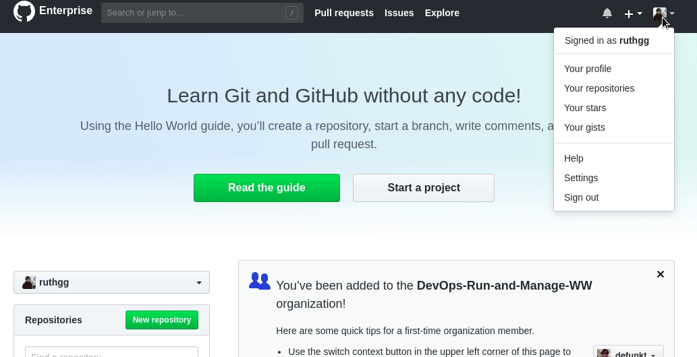
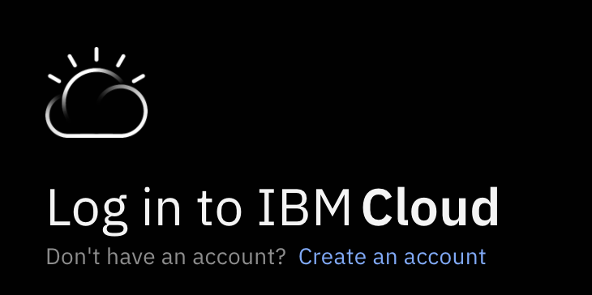
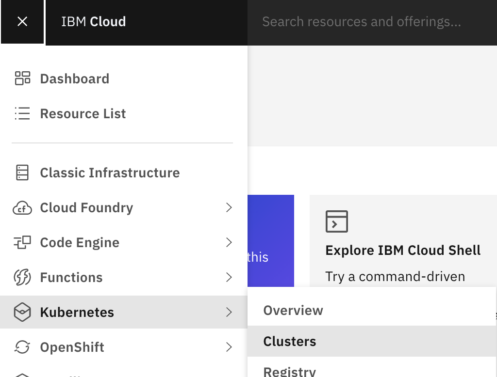
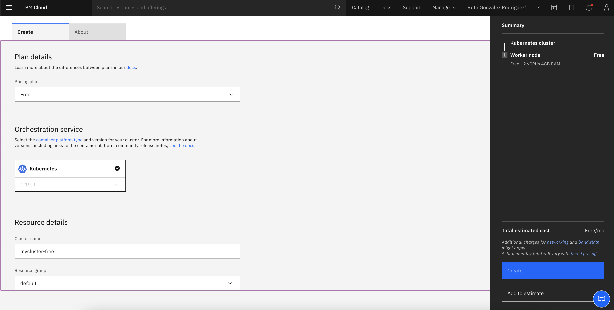
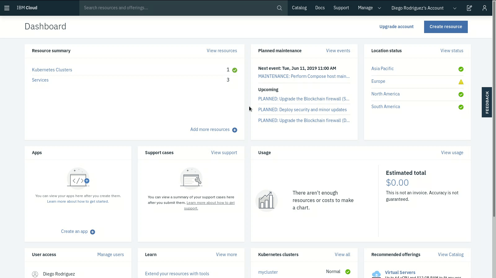

# DevOps Bootcamp

## Contents
- [DevOps Bootcamp](#devops-bootcamp)
  - [Contents](#contents)
  - [Prerequisites](#prerequisites)
    - [Education](#education)
    - [Docker classroom](#docker-classroom)
    - [Assessment](#assessment)
    - [Local Machine Requirements](#local-machine-requirements)
    - [Keys and accounts creation](#keys-and-accounts-creation)
      - [Docker Hub Account](#docker-hub-account)
      - [Check your keys in GitHub enterprise](#check-your-keys-in-github-enterprise)
      - [IBM Cloud Kubernetes Cluster creation.](#ibm-cloud-kubernetes-cluster-creation)
      - [Create an IBM Cloud APIKEY.](#create-an-ibm-cloud-apikey)
      - [Connecting to IBM Cloud Kubernetes Service cluster.](#connecting-to-ibm-cloud-kubernetes-service-cluster)


## Prerequisites

### Education
1. [3 hours: Docker Essentials](https://yourlearning.ibm.com/activity/URL-7E83D36DDB5D)
2. [1 hour: Kubernetes 101](https://yourlearning.ibm.com/activity/URL-0651426E4A0B)
3. [4 hours: Linux Fundamentals.](https://learning.oreilly.com/videos/linux-fundamentals/9780135560396) 
 - **For Linux Fundamentals course, we suggest taking only following lessons:**
   - Module 1. Essential Commands:
    - Lesson 2: Using Essential Tools.
    - Lesson 3: Essential File Management Tools.
    - Lesson 4: Working with Text Files.

---

### Docker classroom
Once you are done with education, proceed with the following docker laboratories (which include essential practices for the bootcamp). When you're done with each, take an screenshot of the output and send it to DevOps-Bootcamp slack channel:
- [30 min: Cowsay](http://pwd.dst.ibm.com:4000/cowsay/)
- [30 min: Docker Volumes](http://pwd.dst.ibm.com:4000/volumes/)
- [30 min: Docker Ports](http://pwd.dst.ibm.com:4000/ports/)
- [30 min: Docker swarm](http://pwd.dst.ibm.com:4000/Visualizer/)

---

### Assessment
Do you think you are ready for the DevOps Bootcamp? 
Test your knowledge with a pre-assessment we prepared for you!

[30 min: Assessment](https://yourlearning.ibm.com/activity/QUIZ-82DAD94C11BE)

- Minimum score: 80%
- Time: 30 min
- Topics:
  - Linux CLI
  - Docker
  - Kubernetes basics

---

### Local Machine Requirements
- MacOS users, click [here](local-machine-requirements/macos-requirements.md).
- Red Hat 8.x users, click [here](local-machine-requirements/rh8-requirements.md).
- Red Hat 7.x users, click [here](local-machine-requirements/rh7-requirements.md).
- Windows users, click [here](local-machine-requirements/windows-requirements.md).

---

### Keys and accounts creation

#### Docker Hub Account

1. Create Docker Hub account. Go to: https://hub.docker.com/ 
   
2. Select any DockerID for your account, a personal email and a password (take note of your DockerID and password we will need them in the bootcamp).

---

#### Check your keys in GitHub enterprise

1. Log in to [IBM GitHub Enterprise](https://github.ibm.com/)

2. Click on your profile photo, and go to "Settings", and then click on "SSH and GPG keys":
If you have added your keys before, you're going to see something like the following:



If you don't see any key, follow the instructions in [here](https://help.github.com/en/articles/adding-a-new-ssh-key-to-your-github-account) to add a new key.

**Tip:** If you don't feel confident using git in the terminal, you can check and practice with this [cheat-sheet](https://www.git-tower.com/blog/git-cheat-sheet).

---

#### IBM Cloud Kubernetes Cluster creation.
1. Verify if you have an IBM Cloud account with your w3 ID. 
   - Go to [IBM Cloud](https://cloud.ibm.com/login) and login with your w3 credentials.
   - Check in the up-right corner the dropdown list, and verify that your name is listed or selected, as in the following screen:

   - If your name is listed, select it and proceed with step 3, if your name is not listed proceed to create a personal account in step 2.

2. Go to [IBM Cloud](https://cloud.ibm.com/login) and create a personal account. Click on **Create an account**.



**Note:** If you're unable to create your account without a credit card, cancel the procedure and contact a bootcamp mentor.

3. Once logged in, it will display the dashboard of your profile, go to the left menu and click on **Kubernetes**.



4. Now click **Create a cluster**.


5. Write down the cluster name (any name, i.e. mycluster-bootcamp), settings should look like the following:



Click **Create cluster**.

**Note:** If you're unable to create your account without a credit card, cancel the procedure and contact a bootcamp mentor.

1. It will take some minutes to be configured and ready to use. Status will change to green (normal) when it is ready to be used.


---

#### Create an IBM Cloud APIKEY.

As an IBM Cloud user you might want to use an API key when you enable a program or script without distributing your password to the script. To create an API key for your user identity in the UI, complete the following steps:
1. Go to **Manage > Access(IAM) > IBM Cloud API Keys.**
2. Click **Create an IBM Cloud API key.**
3. Enter a name and description for your API key.
4. Click **Create.**
5. Then, click **Show** to display the API key. Or, click **Copy** to copy and save it for later, or click **Download.**



---

#### Connecting to IBM Cloud Kubernetes Service cluster.

1. Log in to your IBM Cloud account. We will use our API key to log in into our cluster.

```
ibmcloud login -apikey <YOUR_APIKEY>
```

<details>
  <summary>Are you having problems in this step?</summary>

>1. Could not find default resource: If you get this issue, try connecting to IBM Cloud KS Cluster with the following:
>
>```
>ibmcloud login -apikey <YOUR_APIKEY>  -r us-south -g Default
>```
</details>

2. Download the kubeconfig files for your cluster.
```
ibmcloud ks cluster config --cluster <YOUR_CLUSTER_NAME>
```
3. Verify kubectl can communicate with your cluster.
```
kubectl cluster-info
```
