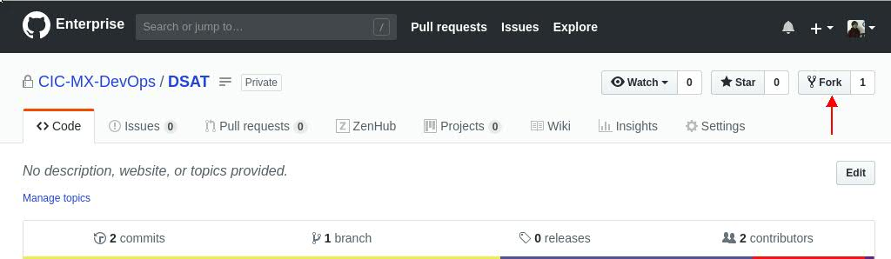
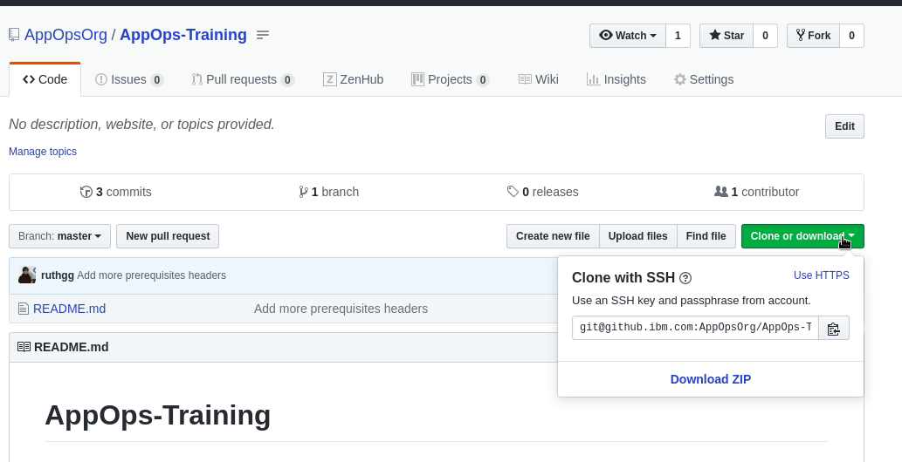
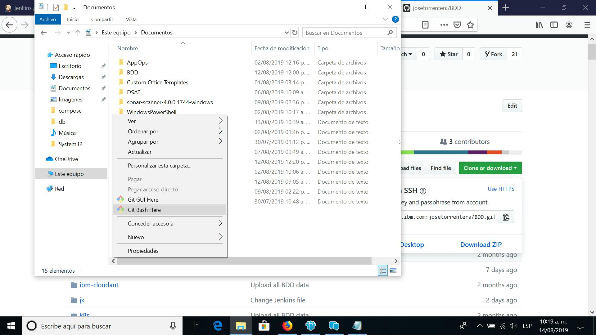

# AppOps-Training

## Welcome

## Contents
- [AppOps-Training](#appops-training)
  - [Welcome](#welcome)
  - [Contents](#contents)
  - [Prerequisites](#prerequisites)
    - [Education](#education)
      - [Desirable](#desirable)
    - [Assessment](#assessment)
    - [Docker classroom](#docker-classroom)
    - [Local Machine Requirements](#local-machine-requirements)
    - [1. Installing IBM Cloud tools](#1-installing-ibm-cloud-tools)
    - [2. Installing Docker in RHEL](#2-installing-docker-in-rhel)
    - [3. Testing Docker Installation](#3-testing-docker-installation)
    - [4. Installing Docker Compose](#4-installing-docker-compose)
    - [5. Github](#5-github)
      - [Check your keys in github enterprise](#check-your-keys-in-github-enterprise)
      - [Fork this repository and clone your forked repository in your machine](#fork-this-repository-and-clone-your-forked-repository-in-your-machine)
    - [6. Validate TaaS Artifactory access](#6-validate-taas-artifactory-access)
    - [7. Validate TaaS Jenkins access](#7-validate-taas-jenkins-access)
    - [8. IBM Cloud Kubernetes Cluster creation](#8-ibm-cloud-kubernetes-cluster-creation)
    - [9. Create an IBM Cloud APIKEY](#9-create-an-ibm-cloud-apikey)
    - [10. Connecting to IBM Cloud KS cluster](#10-connecting-to-ibm-cloud-ks-cluster)
    - [11. Installing IBM Cloud Private CLI](#11-installing-ibm-cloud-private-cli)
    - [12. SonarQube project creation](#12-sonarqube-project-creation)


## Prerequisites

### Education
1. [Docker Essentials](https://yourlearning.ibm.com/activity/URL-7E83D36DDB5D)
2. [Kubernetes 101](https://www.ibm.com/cloud/architecture/content/course/kubernetes-101)
3. [Basic Linux CLI (Chapter 1, 2, 3 and 12)](https://learning.oreilly.com/library/view/basic-linux-terminal/9781484260357/)

#### Desirable


### Assessment

### Docker classroom

### Local Machine Requirements

### 1. Installing IBM Cloud tools

1. For Mac and Linux, run the following command:
```
curl -sL http://ibm.biz/idt-installer | bash
```  
For Windows 10, run the following command (Right-click the Windows PowerShell icon, and select Run as administrator):
```
[Net.ServicePointManager]::SecurityProtocol = "Tls12"; iex(New-Object Net.WebClient).DownloadString('https://ibm.biz/idt-win-installer')
```  
2. Verify the installation running:

```
ibmcloud help
```

After this installation, windows will request to restart your machine.

More info [here](https://cloud.ibm.com/docs/cli?topic=cloud-cli-getting-started)

### 2. Installing Docker in RHEL

Docker is included and installed in pre-requisite 1, in all operative systems (except for RHEL).
If you're working with RHEL follow the next steps:

1. Install required packages
```
sudo yum install -y yum-utils \
device-mapper-persistent-data \
lvm2
```

2. Add **stable** repository
```
sudo yum-config-manager \
--add-repo \
https://download.docker.com/linux/centos/docker-ce.repo
```

3. Install Docker
```
sudo yum install docker-ce docker-ce-cli containerd.io
```

More info [here](https://docs.docker.com/install/linux/docker-ce/centos/)


### 3. Testing Docker Installation

To test your installation in Windows 10 test your installation following the instructions [here](https://docs.docker.com/docker-for-windows/#test-your-installation).

For any other OS, run the following:
```
docker --help
lvm2
```

### 4. Installing Docker Compose

For RHEL workstations, follow the next steps:

1. Run this command to download the current stable release of Docker Compose:

```
sudo curl -L "https://github.com/docker/compose/releases/download/1.24.0/docker-compose-$(uname -s)-$(uname -m)" -o /usr/local/bin/docker-compose
```

2. Apply executable permissions to the binary:
```
sudo chmod +x /usr/local/bin/docker-compose
```

3. Test the installation:
```
docker-compose --version
```
Docker Desktop for Windows and Docker Toolbox already include Compose along with other Docker apps, so most Windows users do not need to install Compose separately.

For other OS or troubleshooting check the link [here](https://docs.docker.com/compose/install/).

### 5. Github
Similar to docker, git is installed within IBM Cloud Tools, just verify your installation running:

```.term1
git --version
```

#### Check your keys in github enterprise

1. Log in to [IBM Github Enterprise](https://github.ibm.com/)

2. Click on your profile photo, and go to "Settings", and then click on "SSH and GPG keys":


If you have added your keys before, your going to see something as in the gif.
If you don't see any key, follow the instructions in [here](https://help.github.com/en/articles/adding-a-new-ssh-key-to-your-github-account) to add a new key.

#### Fork this repository and clone your forked repository in your machine


1. Fork this repository, as shown below:



2. Once forked, clone your repository in your machine. Ensure to clone with SSH and copy the text provided.




3. Open a terminal and move to a folder where you want to store the repository, and enter the following:

- For linux based workstations:

```.term1
git clone <your-repository-ssh-key>
```

- For Windows workstations:

1. Open the file explorer and locate where you're going to clone the repository.

2. Right click and select "Git Bash Here"



3. A git terminal will open, so now, clone the repository:

```.term1
git clone <your-repository-ssh-key>
```

You're now ready to do changes, commit and push into your repository. Use this guide for any other repository to clone.

Pro-tip: If you don't feel confident using git in the terminal, you can check and practice with this [cheat-sheet](https://www.git-tower.com/blog/git-cheat-sheet).


### 6. Validate TaaS Artifactory access
Artifactory is a universal Artifact Repository Manager, intergrating with CI/CD and DevOps tools to track your artifacts through the development process. As well as offering generic artifact storage, Artifactory offers bespoke and tool-integrated support for the most popular packages including Maven, Docker, NPM, Helm, PyPI, Gradle, Ivy, Debian and RPM.  
TaaS offers Artifactory Enterprise in two high availability clusters, NA (Dallas) and EU (London). When onboarding to Artifactory, teams should select their primary cluster closest to their build infrastructure - the repository contents will be automatically replicated to the other cluster. This replica is provided for disaster recovery, and as an alternative (read only) download location.  
We will use this repository to store all images created during BDD and DSAT exercise.
Validate your access to Docker Repository. Execute the following commmand and enter with your w3 credentials:
```
docker login gbs-appops-training-docker-local.artifactory.swg-devops.com
```
You should obtain **Login Succeeded**.

### 7. Validate TaaS Jenkins access
Jenkins is a continuous integration and continuous delivery application. By continuously building and testing software projects with Jenkins, it becomes easier for developers to integrate changes in a project and to find and solve defects more rapidly, thereby increasing your productivity.
We will execute our pipeline on Jenkins as a Service offered by IBM. Use your w3 credentials to login into  https://gbs-appops-training-jenkins.swg-devops.com

### 8. IBM Cloud Kubernetes Cluster creation

1. Go to [IBM Cloud](https://cloud.ibm.com/login) and log in with your w3 credentials.
2. Once logged in, it will be displayed  the dashboard of your profile, go to the left menu and click on **Kubernetes**.
3. Now click **Create a cluster**.
4. Select **Free** plan.  Set Geography as **North America** and Metro as **Dallas**
5. Write down the cluster name and click **Create cluster**.
6. The cluster has been requested, it will take some minutes to be configure and ready to use. Status will change to green (normal) when it is ready to be used.


### 9. Create an IBM Cloud APIKEY
As an IBM Cloud user you might want to use an API key when you enable a program or script without distributing your password to the script. A benefit of using an API key can be that a user or organization can create several API Keys for different programs and the API keys can be deleted independently if compromised without interfering with other API keys or even the user.
To create an API key for your user identity in the UI, complete the following steps:
1. Go to **Manage > Access(IAM) > IBM Cloud API Keys.**
2. Click **Create an IBM Cloud API key.**
3. Enter a name and description for your API key.
4. Click **Create.**
5. Then, click **Show** to display the API key. Or, click **Copy** to copy and save it for later, or click **Download.**


### 10. Connecting to IBM Cloud KS cluster

1. Log in to your IBM Cloud account. We will use our API key to login into our cluster.

```
ibmcloud login -apikey <YOUR_APIKEY>  -r us-south
```


<details>
  <summary>Are you having problems in this step?</summary>

>1. Could not find default resource: If you get this issue, try connecting to IBM Cloud KS Cluster with the following:
>
>```
>ibmcloud login -apikey <YOUR_APIKEY>  -r us-south -g Default
>```

</details>


2. Download the kubeconfig files for your cluster.
```
ibmcloud ks cluster-config --cluster <YOUR_CLUSTER>
```
3. Using the output from the previous step, set the KUBECONFIG environment variable. For example:
```
export KUBECONFIG=/home/$USER/.bluemix/plugins/container-service/clusters/mycluster/kube-config-hou02-mycluster.yml
```
4. Verify kubectl can communicate with your cluster.
```
kubectl cluster-info
```


### 11. Installing IBM Cloud Private CLI

1. Login to https://bldbzt1160.bld.dst.ibm.com:8443/

2. Go to the left-menu and select "Command Line Tools" and then "Cloud Private CLI"

3. Open the menu "Install IBM Cloud Private CLI" and select your OS, copy the download command.


4. Open a terminal and run the command.


For Windows, rename the downloaded file to cloudctl and place the file on the PATH environment variable. For Linux and MAC OS follow step 5:

5. Once downloaded, change the permissions of the file:

```.term1
chmod 755 <file>
```

And then move it:

```.term1
sudo mv <file> /usr/local/bin/cloudctl
```

6. Confirm that the IBM Cloud Private CLI is installed:

```.term1
cloudctl --help
```

7. To login to ICP cluster, run the following:

```.term1
cloudctl login -a https://bldbzt1160.bld.dst.ibm.com:8443/ --skip-ssl-validation
```

### 12. SonarQube project creation

1. Validate your access to SonarQube with your w3 credentials:
[SonarQube](http://wdcdmzyz22033184.ibmcloud.dst.ibm.com/about)

3. Once logged, create your project:

- Go to "+" sign, in the up-right corner

- Click on "Create new project"

 **Project Key:** w3-ID-DSAT

 **Display Name:** w3-ID-DSAT

 For **example@ibm.com**:

 ```.term1
 Project Key: example-DSAT

 Display Name: example-DSAT
 ```

 - Click "Set Up". It will get you to a different screen called "Analyze your project"

 - Create a token clicking in "Generate", save this token somewhere you remember (we will use it later in DSAT exercise).

 - In the section "Run analysis on your project", select "Other (JS...)"

 - You're now ready to work with SonarQ.


 - Check that your project is listed in the Projects tab: http://wdcdmzyz22033184.ibmcloud.dst.ibm.com/projects
